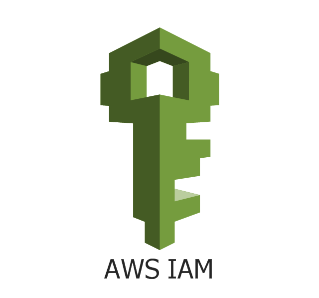
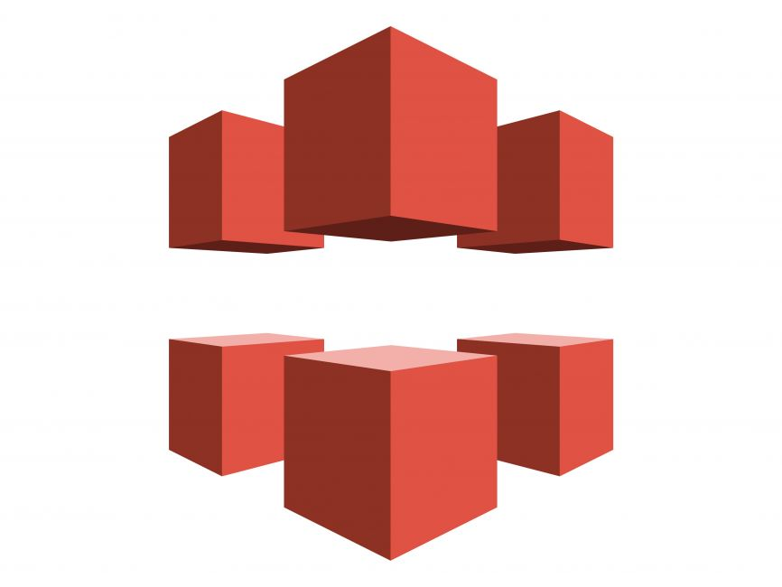

## Gabriela Dias Dutra

Desenvolvedora Frontend | Javascript • React • AWS

### Tecnologias

  

  

  

  

  

  

  

  

---

### Objetivos

Busco minha primeira oportunidade como desenvolvedora frontend, onde eu possa evoluir tecnicamente e contribuir com projetos reais. Quero atuar em um ambiente que valorize organização, boas práticas e aprendizado contínuo.

Sou recém-formada e estou no início da minha carreira. Tenho desenvolvido projetos próprios com React, integração com APIs e deploy na AWS, buscando compreender a arquitetura das aplicações além da implementação. Estou motivada a crescer de forma consistente e assumir responsabilidades progressivamente.

---

### Cloud AWS

 Já utilizei os principais serviços da AWS na minha experiência profissional e portfólio pessoal.

  

  

  

  

  

  

  

  

---

### Conecte-se comigo

